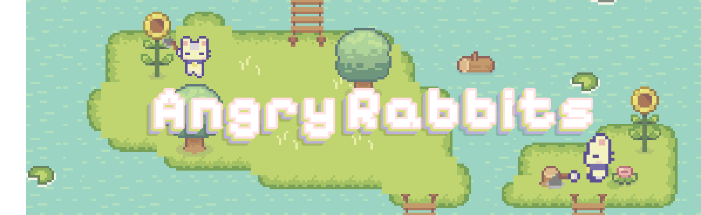
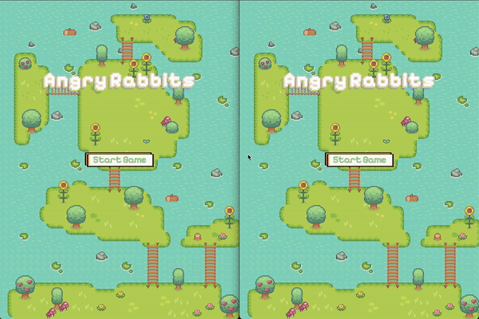

# Angry Rabbits Game


## Gameplay
<p align="center">
  
</p>
The server is hosted on a free platform, which may result in high ping for players 🫠

## Overview

"Angry Rabbits" is an engaging multiplayer game where players control rabbits and throw axes at each other. The game consists of a server-side component written in Node.js and a client-side component written in C++ using WebSocket++ and SFML.

## Features

- **Multiplayer Support:** Create and join game rooms for multiplayer fun.
- **Real-time Communication:** The server manages game state and communicates with clients via WebSocket.
- **Interactive Gameplay:** Players can move around the map and throw axes at other players.
- **Smooth Graphics:** Utilizes SFML for rendering and game mechanics.

## Architecture

### Server (Node.js)

- **Room Management:** Creates and manages rooms for players.
- **Game State Handling:** Continuously updates and sends game state to all participants in real-time.
- **Hosting:** The server is hosted on glitch.me, a free hosting service.

### Client (C++)

- **WebSocket++ Integration:** Connects to the server via WebSocket++ for real-time communication.
- **Thread Management:** The client architecture is divided into separate threads for:
  - **Connection:** Establishing and maintaining WebSocket connections with the server.
  - **Sending:** Sending player actions and updates to the server.
  - **Receiving:** Processing responses from the server and updating the game state.

- **SFML for Graphics:** Uses SFML for rendering the game world and handling player interactions.

## Technologies Used

- **Node.js:** For server logic and room management.
- **C++:** For the client application.
- **WebSocket++:** For real-time communication between client and server.
- **SFML:** For graphics rendering and user interface.
- **STL:** Standard Template Library for data structures and algorithms.
- **nlohmann::json:** For easy JSON handling.

## Installation

### Client

1. Navigate to the client directory:
    ```bash
    cd client
    ```
2. Create a build directory:
    ```bash
    mkdir build
    cd build
    ```
3. Generate build files with CMake:
    ```bash
    cmake ..
    ```
4. Compile the project:
    ```bash
    make
    ```
5. Run the client:
    ```bash
    ./main
    ```
    
# License
This project is licensed under the MIT License.
